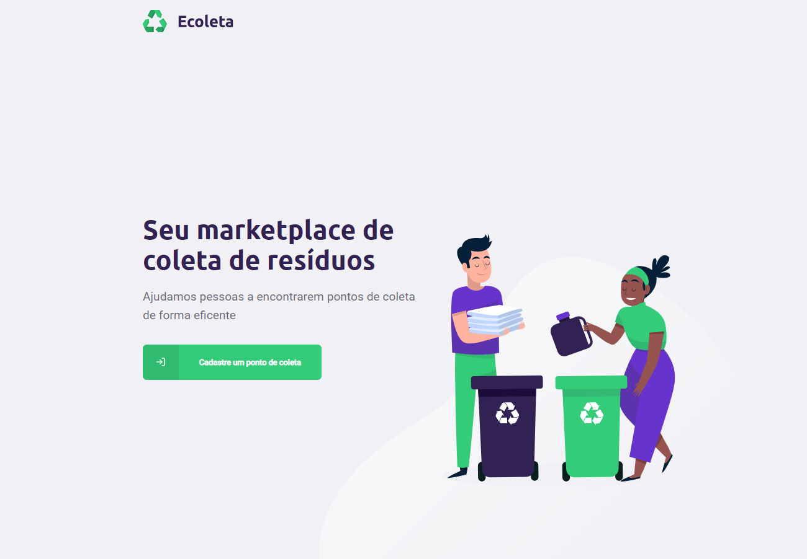

<h1 align="center">
     
 

<h3 align="center">
   
Desenvolvido na Next Level Week (1.0) da [Rockeseat](https://rocketseat.com.br)

</h3>
</h1>
 

- O que é o Projeto?

  > O projeto desenvolvido tem a ideia de conectar empresas ou entidades que trabalham com tratamento de resídos de diversos tipos, com pessoas que precisam descarta esses resídos de formar adequada

## 💻 Tecnologias:

#### Server:

- [x] TypeScript
- [x] NodeJS
- [x] Cors
- [x] KnexJs
- [x] Express
- [x] SQLite

#### Website:

- [x] TypeScript
- [x] ReactJS
- [x] Axios
- [x] Leaflet

#### Mobile:

- [x] TypeScript
- [x] React Native
- [x] Expo
- [x] React Native Maps
- [x] React Native SVG
- [x] Expo Location
- [x] Expo Google Fonts
- [x] Expo Mail Composer

### :camera:💻 Website:

### :camera:📱 Mobile:

  

  
  
  

## Tecnologias:

## ⚙ Inicialização

#### Server

Instalar as dependências:

> yarn

Iniciar a Server:

> yarn dev

#### Web

Instalar as dependências:

> yarn

Iniciar a aplicação:

> yarn start
